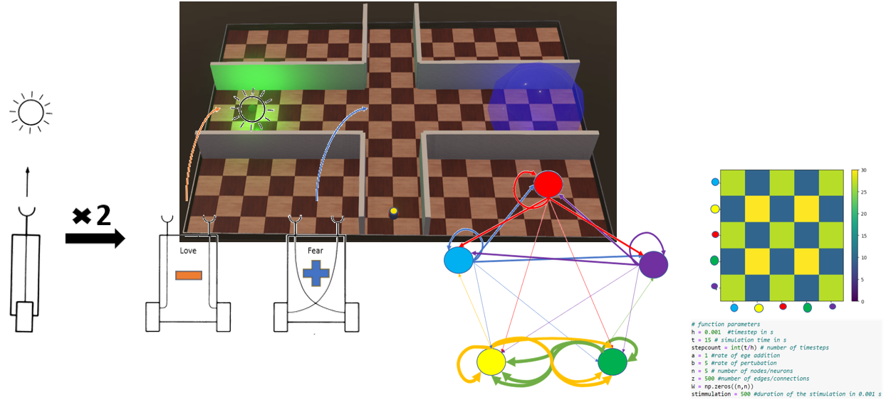
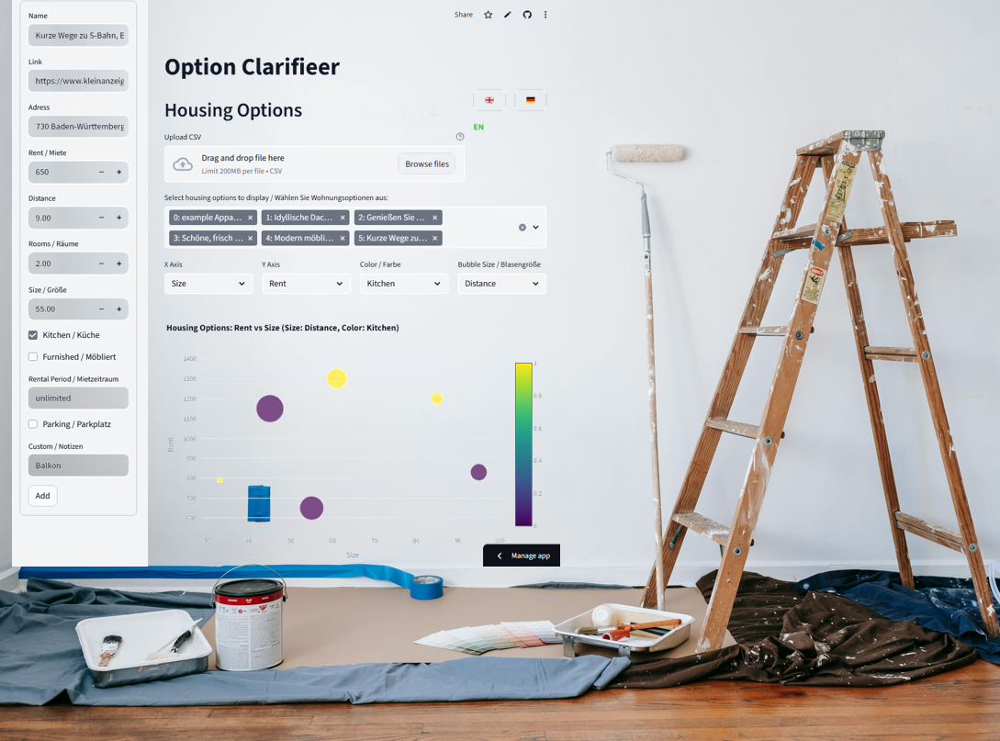
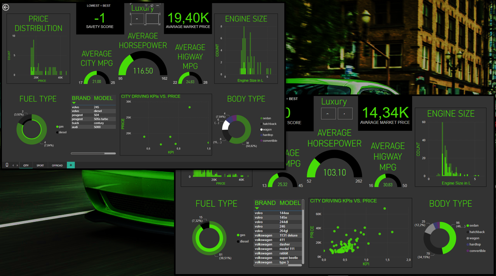
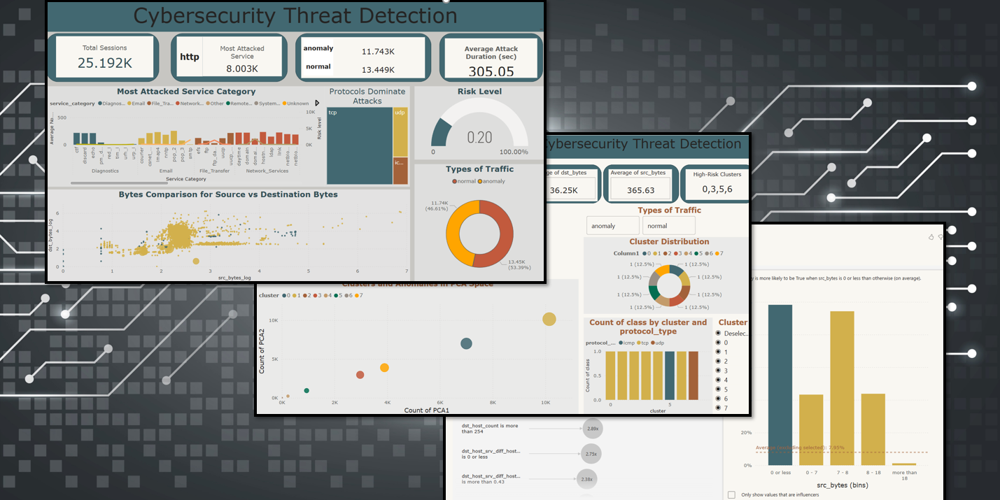

# Maximilian Klein — Neurobiology → AI & Robotics → Ecological Textiles
**Computational Neuroscientist & Applied AI Engineer**  
_Working at DITF Denkendorf on sustainable materials and digital transformation_

---

## About Me
Neurobiologist by training — now applying **AI and digitalization** to sustainable material development.  
At **DITF Denkendorf**, I work on **environmentally friendly alternatives to textiles and leather**,  
developing digital tools and twins for **process understanding**, **simulation**, and **optimization**.

- **M.Sc. Computaional Neuroscience**  
- Developed a **self-learning robot** with a **plastic neural network** that adapts to changing environments with and without predators  
- Completed a **4-month Data Science training**: AI tools, data visualization, and dashboarding
- Working at **DITF Denkendorf** on the transformation of the textile industry toward sustainable, eco-friendly, and recyclable alternatives to textiles and leather.

---

## Featured Projects

| Project | Description | Tech |
|----------|--------------|------|
| **Adaptive Braitenberg Vehicle** | Simulation of a robot with a plastic (adaptive) neural network improving survival in dynamic environments. [View](#robot)| Python · PyTorch · ROS · Webots |
| **Sustainable Material Analytics (DITF)** | Process analysis and optimization for eco-alternatives to leather and textiles using digital twins and ML. | Python · Pandas · ML · Plotly |
| **Urban Housing Dashboard** | Streamlit app for visualizing housing markets and supporting multi-criteria decision making. [View](#housing)| Streamlit · Pandas · Plotly |
| **Car Value & Suitability Analysis** | Dashboard comparing cars for city, outdoor, and sport use based on value, engine data, and energy profile. [View](#car-analysis) | Python ·  · Plotly |
| **Cyberattack Classification** | Detection and classification of malicious network traffic in mixed datasets. [View](#cybersecure-analysis)| scikit-learn · XGBoost · SHAP |
| Pyramid Training App | Time-based pyramid workout with automatic rep-timing and matching countdown signals. [View](#Pyramid)| Tkinter · Python · Timer Logic |

---

# A closer look
 

## Adaptive Braitenberg Agent with Plastic Neuronal Network

This project was my masters thesis and introduces a novel learning framework for autonomous agents by extending classical Braitenberg vehicles with a plastic neuronal network based on the Direct Configuration Model. Instead of relying on fixed architectures or gradient-based optimisation, the agent adapts through structural plasticity: synaptic connections are created, removed, or reweighted in direct response to environmental demands.

In a simulated, continuously changing environment — with and without predators — the agent develops robust survival strategies, including avoidance, exploration, and resource-seeking. Behaviour emerges from sensorimotor coupling and self-organised network restructuring, demonstrating how simple biological rules can generate complex, adaptive intelligence.

This work proposes an alternative path for AI development by focusing on network morphology, embodiment, and experience-driven rewiring, offering a biologically inspired route toward self-modifying, interpretable learning systems.

[View this repository](https://github.com/MaximilianKlein92/Webots-Breitenberg)

## Housing decition helper App

I built a lightweight tool with stremlit to simplify housing searches.
The app allows users to collect housing listings from the internet by entering core fields such as Name, Link, Address, Rent, Distance, Rooms, Size, Rental Period, Kitchen/Furnished, and Parking.

All entries appear in an editable local database table. No cloud connection is needed. You can export the dataset as a CSV or import an existing CSV in the correct format, making it easy to work across multiple devices.

To support better decision-making, the app generates a fully customizable scatter plot. You can select any variables for the X- and Y-axis, colour-code categories, and change bubble size to match another parameter. The plot also highlights mean values for the chosen KPIs, giving a quick overview of how each option compares to the general trend.

The interface supports English and German, so the tool can be used in both languages.

Overall, the goal was to create a simple, practical helper that combines clean data handling with visual analytics—without the complexity of a cloud service.

The app is available online: [Housing decision helper (live)](https://decitiondeceph.streamlit.app/)

[View this repository](https://github.com/MaximilianKlein92/Apartment-Decision-helper)

## Car Value & Suitability Analysis

This 5-day-project implements an end-to-end analytics pipeline (ETL → EDA → modeling) using the Kaggle Car Price dataset (205 cars, 26 features) to identify key factors influencing vehicle pricing and market segmentation. 

Correlation and regression analyses reveal engine size, horsepower, and brand as the strongest predictors of price, while derived metrics such as power-to-weight ratio and fuel efficiency (mpg_ratio) enhance interpretability. 
Composite suitability scores (city/family, outdoor/off-road, sport) enable persona-based insights and luxury segmentation. 

The team applied agile project management with a Kanban board to coordinate tasks among four collaborators, ensuring transparency, accountability, and efficient workflow. 

Final deliverables include a cleaned dataset, Jupyter notebooks, and a Power BI dashboard framework for interactive exploration and strategic decision support.

[View this repository](https://github.com/MaximilianKlein92/car-price-analysis-hackathon/tree/main)

## Cyberattack Classification

In a 5-day-hackaton I contributed with 4 others to this project whitch builds an end-to-end pipeline for network-intrusion analytics: 
- reusable ETL
- exploratory analysis
- unsupervised modeling
- a Power BI UI 

Using the KDD-style Kaggle dataset (41 features), we apply PCA and K-Means to profile traffic and rank anomalies via a composite score (centroid distance + silhouette + cluster risk). 

Error-rate features (serror_rate, rerror_rate, srv_serror_rate) and rare service/flag patterns (REJ, S0; telnet/private) are the strongest indicators. High-risk clusters (0, 3, 5, 6) capture probing/brute-force/ICMP attacks, including one critical Telnet intrusion. 

The team applied agile project management with a Kanban board to coordinate tasks among four collaborators, ensuring transparency, accountability, and efficient workflow. 

Outputs include cleaned data, cluster profiles, top-anomalies lists, and an explainable dashboard for SOC triage.

[View this repository](https://github.com/MaximilianKlein92/Cybersecurity-Threat-Analysis/tree/main)

## Pyramid Training – Tkinter Sport App

This was my first Project and has always a special place in my heard. This app enables time-based pyramid training. You perform one repetition of an exercise, then press Pause. The app measures the exact time your repetition took. After that, it automatically starts a countdown of the same length.

In the next round, you perform one repetition more and repeat the process. You continue until muscle failure, and then work your way downwards again.

The entire session runs within a set total time (by default 7.5 minutes, fully adjustable). During training, the app displays clear timer information and provides an acoustic countdown signal.

The system is minimalistic, intuitive, and built entirely with Tkinter and also works in a android phone with a python compiler on it.

[View this repository](https://github.com/MaximilianKlein92/Pyramid-Intervall-GUI)

